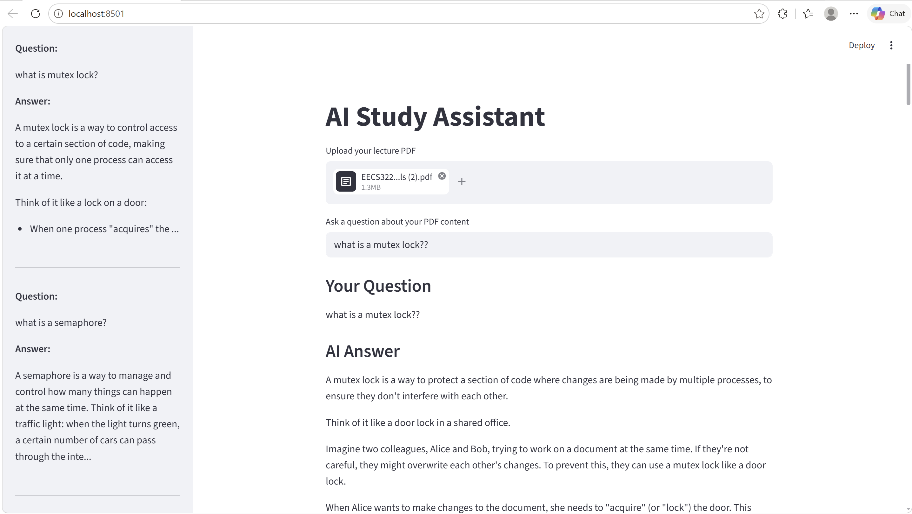
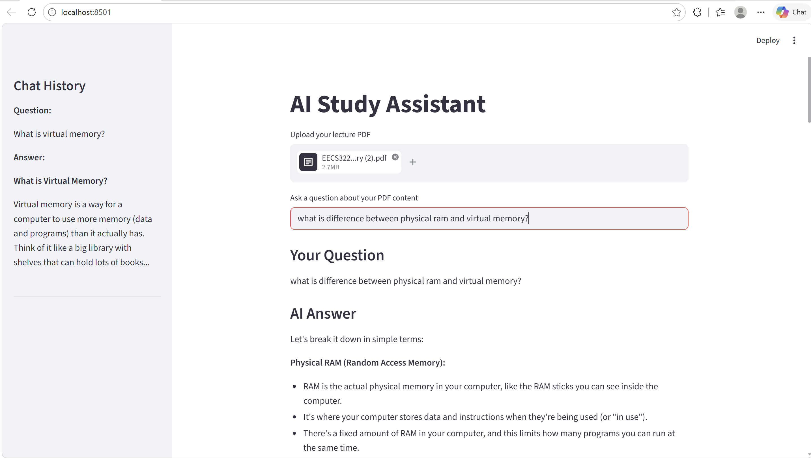

# AI Study Assistant

A Streamlit study assistant for PDF lecture notes. The app extracts text from a PDF, builds semantic embeddings with SentenceTransformers, retrieves relevant passages via FAISS, and generates answers using the Groq LLM client.

## Features

- Upload a PDF and extract page text.
- Chunk the PDF text into overlapping passages.
- Build embeddings using `all-MiniLM-L6-v2`.
- Perform semantic search over the PDF content with FAISS.
- Ask questions and get student-friendly answers from an LLM.
- View chat history in a sidebar while using the app.

## Installation

1. Create and activate a Python virtual environment:

```powershell
python -m venv .venv
.\.venv\Scripts\Activate.ps1
```

2. Install dependencies:

```powershell
pip install -r requirements.txt
```

3. Install `groq` if it is not already included in `requirements.txt`:

```powershell
pip install groq
```

4. Create a `.env` file with your Groq API key:

```text
API_KEY=your_groq_api_key_here
```

## Usage

1. Run the app:

```powershell
streamlit run app.py
```

2. Open the URL shown by Streamlit (typically `http://localhost:8501`).
3. Upload your lecture PDF using the file uploader.
4. Enter a question about the PDF content.
5. Read the AI-generated answer and review chat history in the sidebar.

## Environment

- `app.py` loads `.env` using `python-dotenv` and expects `API_KEY` for the Groq client.
- Current code uses the Groq LLM API, not Ollama.
- If you change the backend, update the request logic in `app.py` accordingly.

## Dependencies

- `streamlit`
- `pypdf`
- `sentence-transformers`
- `faiss-cpu`
- `python-dotenv`
- `groq`
- `numpy`

## Notes

- If your PDF is image-only or scanned, text extraction may return empty strings. Use OCR first.
- The current chunker uses fixed-size text slices with overlap, so sentences may be split.
- Chat history is displayed in the sidebar and updates with each question.
- The app shows the source chunk indices used for retrieval.

## Demo screenshots





## Suggested improvements

- Add caching for the SentenceTransformer model and FAISS index.
- Add richer source attribution, including page numbers.
- Persist chats between sessions using local storage or a database.
- Add an example PDF to `sample_notes/` for quick demo use.

## Project files

- `app.py` — main Streamlit application.
- `requirements.txt` — dependency list.
- `sample_notes/` — place sample PDFs here for quick testing.
- `Images/` — demo screenshot assets.
